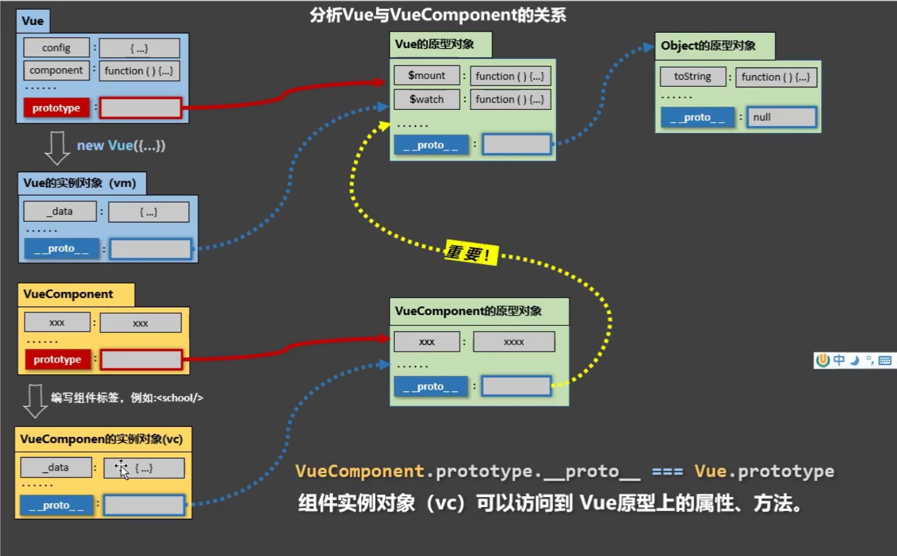

# Markdown 基础语法

## (1) Markdown 标题	

```yaml
# 一级标题
## 二级标题
### 三级标题
#### 四级标题
##### 五级标题
###### 六级标题
```


## (2) Markdown 文本

``` yaml
*斜体文本*
**粗体文本**
***斜粗体文本***
_斜体文本_
__粗体文本__
___斜粗体文本___
```

### 例如

*斜体文本*

**粗体文本**

***斜粗体文本***

_斜体文本_

__粗体文本__

___斜粗体文本___


## (3) Markdown 列表

* 无序列表，使用 **星号**(*****)、**加号**(**+**)、**减号**(**-**) 加一个 **空格** 作为列表标记
* 有序列表，使用 **数字**再加上 (**.**) **号**，再加上一个 **空格** 作为列表标记

```yaml
* 无序列表 1
+ 无序列表 2
- 无需列表 3

1. 有序列表 1
2. 有序列表 2
3. 有序列表 3
```

### 例如

* 无序列表 1
* 无序列表 2

  - 无序列表 3

1. 有序列表 1
2. 有序列表 2
3. 有序列表 3


## (4) Markdown 链接

```yaml
[链接名称](链接地址)
[百度](https://www.baidu.com)

或者

<链接地址>
<https://www.baidu.com>
```

### 例如

[百度](https://www.baidu.com)

<https://www.baidu.com>


## (5) Markdown 引用

引用的格式是在符号 **>** 后面书写文字，或者加一个空格在书写文字

```yaml
>这是一个引用
> 这是一个引用
```

### 例如

> 这是一个引用

> 这是一个引用


## (6) Markdown 分割线

可以在一行中用 **三个 -** 或者 ***** 来建立一个分割线，同时需要在分割线的上面空一行

``` yaml
---
这是一个分割线

或者

***
*****
```

### 例如

***

*****

---

----------------

---

***

*****

***


## (7) Markdown 删除线

删除线的使用，需要在删除的文字 **前后** 各使用 **两个** **~** 

```yaml
~~这是要删除的内容~~
```

### 例如

~~这段内容要被删除了~~


## (8) Markdown 下划线

下划线的使用，在需要添加下划线的文字首部和尾部加上 `<u>文本</u> `，如下

```yaml
<u>这行文字已被添加下划线</u>
```

### 例如

<u>这行文字已被添加下划线</u>


## (9) Markdown 表格

表格使用 `|` 来分隔不同的单元格，使用 `-` 来分隔表头和其他行，如果想调整表格的左对齐、右对齐、居中对齐：

* `:-`   将表头及单元格的内容 **左对齐**
* `:-:` 将表头及单元格的内容 **居中对齐**
* `-:`   将表头及单元格的内容 **右对齐**

```yaml
|第一列|第二列|第三列|
|:-|:-:|-:|
|你好|hello world|学 Java ，狠狠赚一笔|
```

### 例如

| 第一列 |   第二列    |               第三列 |
| :----- | :---------: | -------------------: |
| 你好   | hello world | 学 Java ，狠狠赚一笔 |


| 第一列 | 第二列      | 第三列               |
| ------ | ----------- | -------------------- |
| 你好   | hello world | 学 Java ，狠狠赚一笔 |


## (10) Markdown 图片

```yaml


```

### 例如




## (11) Markdown 脚注

脚注是对文本的备注说明，脚注与链接的区别，如下：

```yaml
链接：[文字](链接)

脚注：文字[^脚注名字]
[^脚注名字]: 这是一个脚注
```

### 例如

链接：[百度](https://www.baidu.com)

脚注：百度[^起源]     创业[^1]

[^1]: 创业：即赚钱
[^起源]: 666


## (12) Markdown 代码块

如果要引用代码块，用  `  `` ` 符号包裹起来即可，或者直接输入 ` ``` ` 后面加语言的名字，也可以不加

```c++
#include <iostream>
using namespace std;

int main()
{
	cout << "hello world" << endl;
    return 0;
}
```


# Markdown 高级语法

## (1) Markdown 数学公式

```yaml
$$
	这里写公式语法
$$
```


$$
H(D_2) = -\left(\frac{2}{4}\log_2 \frac{2}{4} + \frac{2}{4}\log_2 \frac{2}{4}\right) = 1
$$

$$
\ce{Hg^2+ ->[I-] HgI2 ->[I-] [Hg^{II}I4]^2-}
$$

$$
\begin{pmatrix}
  1 & a_1 & a_1^2 & \cdots & a_1^n \\
  1 & a_2 & a_2^2 & \cdots & a_2^n \\
  \vdots & \vdots & \vdots & \ddots & \vdots \\
  1 & a_m & a_m^2 & \cdots & a_m^n \\
  \end{pmatrix}
$$


## (2) Markdown TOC(Table of Content)

列出全部标题，通俗点说，就是一个小目录

```yaml
[TOC] 或者 [toc]
```


[TOC]

## (3) Markdown HTML

```html
<span style="display:block;text-align:right;color:orangered;">橙色居右</span>
<span style="display:block;text-align:center;color:orangered;">橙色居中</span>
```

<span style="display:block;text-align:right;color:orangered;">橙色居右</span>
<span style="display:block;text-align:center;color:orangered;">橙色居中</span>

<font face="黑体">我是黑体字</font>
<font face="微软雅黑">我是微软雅黑</font>
<font face="STCAIYUN">我是华文彩云</font>
<font color=#0099ff size=7 face="黑体">color=#0099ff size=72 face="黑体"</font>
<font color=#00ffff size=72>color=#00ffff</font>
<font color=gray size=72>color=gray</font>


## (4) Markdown 转义

在 `Markdown` 编辑器里面使用了很多特殊符号来表示特定的意义，该特殊符号将不再显示，这个时候就需要转义字符——反斜杠，如下：

```yaml
\*\*转义特殊符号正常显示\*\*

**无转义特殊符号无法正常显示**
```

\*\*转义特殊符号正常显示\*\*

**无转义特殊符号无法正常显示**


## (5) Markdown URL


## (6) Markdown 流程图和时序图


## (7) Markdown 复选框

使用 `- [ ]` 和 `- [x]` 语法可以创建复选框，实现 `todo-list` 等功能，如下：

```yaml
默认没选：- [ ] 
默认勾选：- [x] 
```

- [ ] 111

- [x] 222
- [x] 333
