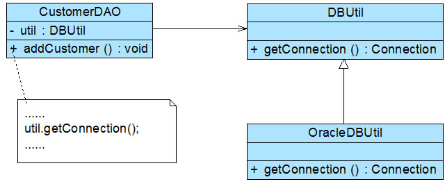
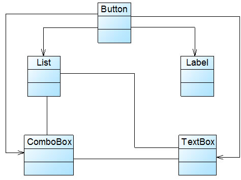
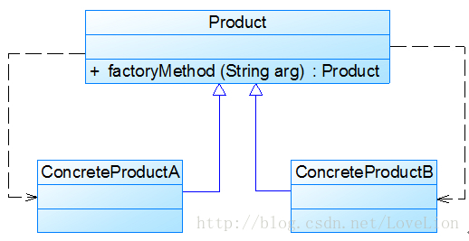
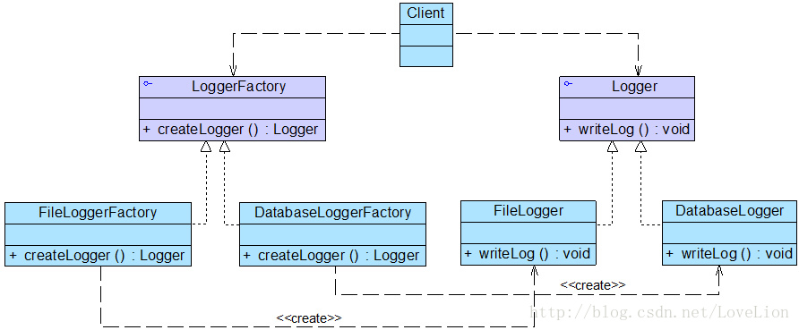
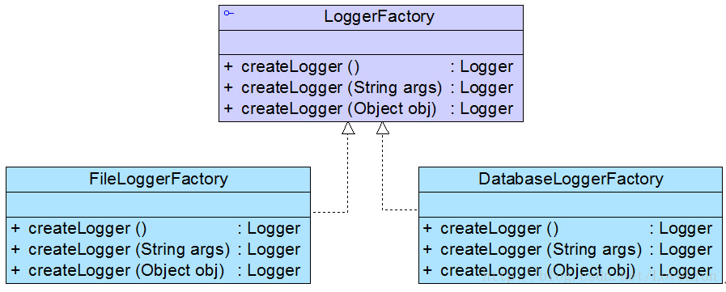

# 模式

## 1、什么是模式？

模式就是在特定环境下人们解决某类重复出现问题的一套成功或有效的解决方案

## 2、 模式的作用

高效、快速的解决应用问题

# 设计模式

## 1、设计模式包含什么

设计模式一般包含模式名称、问题、解决方案、效果等组成要素

+ 模式名称：通过一两个词来描述模式的问题、解决方案和效果、以便更好理解模式和方便开发人员交流、绝大多数模式都是根据其功能或模式结构来命名的
+ 问题：描述了应该在何时使用模式，包含了设计中存在的问题以及问题存在的原因
+ 解决方案：描述了一个设计模式的组成成分，以及这些组成成分之间的相互关系，各自的职责和协作方式，通常解决方案通过UML类图和核心代码来进行描述
+ 效果：描述了模式的优缺点以及在使用模式时应该权衡的问题

## 2、设计模式分为几种

设计模式（23种）可分为**创建型**，**结构型**和**行为型**三种

+ 创建型模式（5种）：主要用于描述如何创建对象
+ 结构型模式（7种）：主要用于描述如何实现类或对象的组合
+ 行为型模式（11种）：主要用于描述类或对象怎样交互以及怎样分配职责

> 此外，根据某个模式主要是用于处理类之间的关系还是对象之间的关系，设计模式还可以分为**类模式**和**对象模式**，我们经常将两种分类模式结合使用，如单例模式是对象创建型模式，模板方法模式是类行为模式

<h3 style="color: red">"简单工厂模式"并不在23种设计模式之中</h3>

## 3、设计模式有什么用

1. 设计模式来源众多专家的经验和智慧，它们是从许多优秀的软件系统中总结出的成功的、能够实现可维护性复用的设计方案，使用这些方案将可以让我们避免做一些重复性的工作，也许我们冥思苦想得到的一个“自以为很了不起”的设计方案其实就是某一个设计模式。在时间就是金钱的今天，设计模式无疑会为有助于我们提高开发和设计效率，但它不保证一定会提高
2. 设计模式提供了一套通用的设计词汇和一种通用的形式来方便开发人员之间沟通和交流，使得设计方案更加通俗易懂。交流通常很耗时，任何有助于提高交流效率的东西都可以为我们节省不少时间。无论你使用哪种编程语言，做什么类型的项目，甚至你处于一个国际化的开发团队，当面对同一个设计模式时，你和别人的理解并无二异，因为设计模式是跨语言、跨平台、跨应用、跨国界的
3. 大部分设计模式都兼顾了系统的可重用性和可扩展性，这使得我们可以更好地重用一些已有的设计方案、功能模块甚至一个完整的软件系统，避免我们经常做一些重复的设计、编写一些重复的代码。此外，随着软件规模的日益增大，软件寿命的日益变长，系统的可维护性和可扩展性也越来越重要，许多设计模式将有助于提高系统的灵活性和可扩展性，让我们在不修改或者少修改现有系统的基础上增加、删除或者替换功能模块。如果一点设计模式都不懂，我想要做到这一点恐怕还是很困难的
4. 合理使用设计模式并对设计模式的使用情况进行文档化，将有助于别人更快地理解系统。如果某一天因为升职或跳槽等原因，别人接手了你的项目，只要他也懂设计模式，我想他应该能够很快理解你的设计思路和实现方案，让你升职无后患之忧，跳槽也心安理得，何乐而不为呢？
5. 最后一点对初学者很重要，学习设计模式将有助于初学者更加深入地理解面向对象思想，让你知道：如何将代码分散在几个不同的类中？为什么要有“接口”？何谓针对抽象编程？何时不应该使用继承？如果不修改源代码增加新功能？同时还让你能够更好地阅读和理解现有类库（如JDK）与其他系统中的源代码，让你早点脱离面向对象编程的“菜鸟期”

> 个人观点：
>
> * 掌握设计模式并不是件很难的事情，关键在于多思考，多实践，不要听到人家说懂几个设计模式就很“牛”，只要用心学习，设计模式也就那么回事，你也可以很“牛”的，一定要有信心
> * 在学习每一个设计模式时至少应该掌握如下几点：这个设计模式的意图是什么，它要解决一个什么问题，什么时候可以使用它；它是如何解决的，掌握它的结构图，记住它的关键代码；能够想到至少两个它的应用实例，一个生活中的，一个软件中的；这个模式的优缺点是什么，在使用时要注意什么。当你能够回答上述所有问题时，恭喜你，你了解一个设计模式了，至于掌握它，那就在开发中去使用吧，用多了你自然就掌握了
> *  “如果想体验一下运用模式的感觉，那么最好的方法就是运用它们”。设计模式是“内功心法”，它还是要与“实战招式”相结合才能够相得益彰。学习设计模式的目的在于应用，如果不懂如何使用一个设计模式，而只是学过，能够说出它的用途，绘制它的结构，充其量也只能说你了解这个模式，严格一点说：不会在开发中灵活运用一个模式基本上等于没学。所以一定要做到：少说多做
> * 千万不要滥用模式，不要试图在一个系统中用上所有的模式，也许有这样的系统，但至少目前我没有碰到过。每个模式都有自己的适用场景，不能为了使用模式而使用模式？滥用模式不如不用模式，因为滥用的结果得不到“艺术品”一样的软件，很有可能是一堆垃圾代码
> * 如果将设计模式比喻成“三十六计”，那么每一个模式都是一种计策，它为解决某一类问题而诞生，不管这个设计模式的难度如何，使用频率高不高，我建议大家都应该好好学学，多学一个模式也就意味着你多了“一计”，说不定什么时候一不小心就用上了。因此，模式学习之路上要不怕困难，勇于挑战，有的模式虽然难一点，但反复琢磨，反复研读，应该还是能够征服的
> * 设计模式的“上乘”境界：“手中无模式，心中有模式”。模式使用的最高境界是你已经不知道具体某个设计模式的定义和结构了，但你会灵活自如地选择一种设计方案【其实就是某个设计模式】来解决某个问题，设计模式已经成为你开发技能的一部分，能够手到擒来，“内功”与“招式”已浑然一体，要达到这个境界并不是看完某本书或者开发一两个项目就能够实现的，它需要不断沉淀与积累，所以，对模式的学习不要急于求成

# 面向对象设计原则

## 概述

对于面向对象软件系统的设计而言，在支持可维护性的同时，提高系统的可复用性是一个至关重要的问题，如何同时提高一个软件系统的可维护性和可复用性是面向对象设计需要解决的核心问题之一。在面向对象设计中，可维护性的复用是以设计原则为基础的。每一个原则都蕴含一些面向对象设计的思想，可以从不同的角度提升一个软件结构的设计水平。

面向对象设计原则为支持可维护性复用而诞生，这些原则蕴含在很多设计模式中，它们是从许多设计方案中总结出的指导性原则。面向对象设计原则也是我们用于评价一个设计模式的使用效果的重要指标之一，在设计模式的学习中，大家经常会看到诸如“XXX模式符合XXX原则”、“XXX模式违反了XXX原则”这样的语句

**常见的7种面向对象设计原则**

| 设计原则名称 | 定义                                             | 使用频率 |
| ------------ | ------------------------------------------------ | -------- |
| 单一职责原则 | 一个类只负责一个功能领域中的相应职责             | ★★★★☆    |
| 开闭原则     | 软件实体应对扩展开放，而对修改关闭               | ★★★★★    |
| 里氏代换原则 | 所有引用基类对象的地方能够透明地使用其子类的对象 | ★★★★★    |
| 依赖倒转原则 | 抽象不应该依赖于细节，细节应该依赖于抽象         | ★★★★★    |
| 接口隔离原则 | 使用多个专门的接口，而不使用单一的总接口         | ★★☆☆☆    |
| 合成复用原则 | 尽量使用对象组合，而不是继承来达到复用的目的     | ★★★★☆    |
| 迪米特法则   | 一个软件实体应当尽可能少地与其他实体发生相互作用 | ★★★☆☆    |

## 1、单一职责原则


如图所示的一个类，类中的方法说明如下：`getConnection()`方法用于连接数据库，`findCustomers()`用于查询所有的客户信息，`createChart()`用于创建图表，`displayChart()`用于显示图表。

`CustomerDataChart`类承担了太多的职责，既包含与数据库相关的方法，又包含与图表生成和显示相关的方法。如果在其他类中也需要连接数据库或者使用`findCustomers()`方法查询客户信息，则难以实现代码的重用。无论是修改数据库连接方式还是修改图表显示方式都需要修改该类，它不止一个引起它变化的原因，违背了单一职责原则。因此需要对该类进行拆分，使其满足单一职责原则，类`CustomerDataChart`可拆分为如下三个类：

1. `DBUtil`：负责连接数据库，包含数据库连接方法`getConnection()`
2. `CustomerDAO`：负责操作数据库中的Customer表，包含对`Customer`表的增删改查等方法，如`findCustomers()`
3. `CustomerDataChart`：负责图表的生成和显示，包含方法`createChart()`和`displayChart()`

使用单一职责原则，重构后的结构如下图所示：


## 2、开闭原则


如图所示，在`ChartDisplay`类的`display()`方法中存在以下片段：

```java
......
if (type.equals("pie")) {
    PieChart pieChart = new PieChart();
    pieChart.display();
} else if (type.equals("bar")) {
    BarChart barChart = new BarChart();
	barChart.display();
}
......
```

在该代码中，如果需要增加一个新的图表类，如折线图`LineChart`，则需要修改`ChartDisplay`类的`display()`方法的源代码，增加新的判断逻辑，违反了开闭原则。

现对该系统进行重构，使之符合开闭原则。

在本实例中，由于在`ChartDisplay`类的`display()`方法中针对每一个图表类编程，因此增加新的图表类不得不修改源代码。可以通过抽象化的方式对系统进行重构，使之增加新的图表类时无须修改源代码，满足开闭原则。具体做法如下：

1. 增加一个抽象图表类`AbstractChart`，将各种具体图表类作为其子类
2. `ChartDisplay`类针对抽象图表类进行编程，由客户端来决定使用哪种具体图表

重构后的结构如下图所示：


我们引入了抽象图表类`AbstractChart`，且`ChartDisplay`针对抽象图表类进行编程，并通过`setChart()`方法由客户端来设置实例化的具体图表对象，在`ChartDisplay`的`display()`方法中调用`chart`对象的`display()`方法显示图表。如果需要增加一种新的图表，如折线图`LineChart`，只需要将`LineChart`也作为`AbstractChart`的子类，在客户端向`ChartDisplay`中注入一个`LineChart`对象即可，无须修改现有类库的源代码

## 3、里氏代换原则

定义：**所有引用基类（父类）的地方必须能透明地使用其子类的对象**

里氏代换原则告诉我们，**在软件中将一个基类对象替换成它的子类对象，程序将不会产生任何错误和异常，反过来则不成立，如果一个软件实体使用的是一个子类对象的话，那么它不一定能够使用基类对象**。里氏代换原则是实现开闭原则的重要方式之一，由于使用基类对象的地方都可以使用子类对象，因此**在程序中尽量使用基类类型来对对象进行定义，而在运行时再确定其子类类型，用子类对象来替换父类对象**


如上图所示，客户(Customer)可以分为VIP客户(`VIPCustomer`)和普通客户(`CommonCustomer`)两类，系统需要提供一个发送Email的功能

在对系统进行进一步分析后发现，无论是普通客户还是VIP客户，发送邮件的过程都是相同的，也就是说两个`send()`方法中的代码重复，而且在本系统中还将增加新类型的客户。为了让系统具有更好的扩展性，同时减少代码重复，使用里氏代换原则对其进行重构


重构之后，新增加一个`Customer`类作为`CommonCustomer`和`VIPCustomer`的抽象类，邮件发送类`EmailSender`针对抽象客户类`Customer`编程，根据里氏代换原则，能够接受基类对象的地方必然能够接受子类对象，因此将`EmailSender`中的`send()`方法的参数类型改为`Customer`，如果需要增加新类型的客户，只需将其作为`Customer`类的子类即可

## 4、依赖倒转原则

定义：***抽象不应该依赖于细节，细节应当依赖于抽象。换言之，要针对接口编程，而不是针对实现编程***


如上图所示，每次转换数据时数据来源不一定相同，因此需要更换数据转换类，如有时候需要将`TXTDataConvertor`改为`ExcelDataConvertor`，此时，需要修改`CustomerDAO`的源代码，而且在引入并使用新的数据转换类时也不得不修改`CustomerDAO`的源代码，系统扩展性较差，违反了开闭原则，现需要对该方案进行重构

重构后如下图：


由于`CustomerDAO`针对具体数据转换类编程，因此在增加新的数据转换类或者更换数据转换类时都不得不修改`CustomerDAO`的源代码。我们可以通过引入抽象数据转换类解决该问题，在引入抽象数据转换类`DataConvertor`之后，`CustomerDAO`针对抽象类`DataConvertor`编程，而将具体数据转换类名存储在配置文件中，符合依赖倒转原则。根据里氏代换原则，程序运行时，具体数据转换类对象将替换`ataConvertor`类型的对象，程序不会出现任何问题。更换具体数据转换类时无须修改源代码，只需要修改配置文件；如果需要增加新的具体数据转换类，只要将新增数据转换类作为`DataConvertor`的子类并修改配置文件即可，原有代码无须做任何修改，满足开闭原则

***重点***

>在上述重构过程中，我们使用了开闭原则、里氏代换原则和依赖倒转原则，在大多数情况下，这三个设计原则会同时出现，**开闭原则是目标，里氏代换原则是基础，依赖倒转原则是手段**，它们相辅相成，相互补充，目标一致，只是分析问题时所站角度不同而已

## 5、接口隔离原则

定义：***使用多个专门的接口，而不使用单一的总接口，即客户端不应该依赖那些它不需要的接口***


如上图所示，方法`dataRead()`用于从文件中读取数据，方法`transformToXML()`用于将数据转换成XML格式，方法`createChart()`用于创建图表，方法`displayChart()`用于显示图表，方法`createReport()`用于创建文字报表，方法`displayReport()`用于显示文字报表。

在实际使用过程中发现该接口很不灵活，例如如果一个具体的数据显示类无须进行数据转换（源文件本身就是XML格式），但由于实现了该接口，将不得不实现其中声明的`transformToXML()`方法（至少需要提供一个空实现）；如果需要创建和显示图表，除了需实现与图表相关的方法外，还需要实现创建和显示文字报表的方法，否则程序编译时将报错。现使用接口隔离原则对其进行重构

重构后如下图：


***在使用接口隔离原则时，我们需要注意控制接口的粒度，接口不能太小，如果太小会导致系统中接口泛滥，不利于维护；接口也不能太大，太大的接口将违背接口隔离原则，灵活性较差，使用起来很不方便***

## 6、合成复用原则

定义：***尽量使用对象组合，而不是继承来达到复用的目的***


如上图所示，与数据库操作有关的类如`CustomerDAO`类等都需要连接数据库，连接数据库的方法`getConnection()`封装在`DBUtil`类中，由于需要重用`DBUtil`类的`getConnection()`方法，设计人员将`CustomerDAO`作为`DBUtil`类的子类

随着客户数量的增加，系统决定升级为Oracle数据库，因此需要增加一个新的`OracleDBUtil`类来连接Oracle数据库，由于在初始设计方案中`CustomerDAO`和`DBUtil`之间是继承关系，因此在更换数据库连接方式时需要修改`CustomerDAO`类的源代码，将`CustomerDAO`作为`OracleDBUtil`的子类，这将违反开闭原则，现使用合成复用原则对其进行重构

重构后如下图所示：



根据合成复用原则，我们在实现复用时应该多用关联，少用继承。因此在本实例中我们可以使用关联复用来取代继承复用。`CustomerDAO`和`DBUtil`之间的关系由继承关系变为关联关系，采用依赖注入的方式将`DBUtil`对象注入到`CustomerDAO`中，可以使用构造注入，也可以使用 **Setter** 注入。如果需要对`DBUtil`的功能进行扩展，可以通过其子类来实现，如通过子类`OracleDBUtil`来连接Oracle数据库。由于`CustomerDAO`针对`DBUtil`编程，根据里氏代换原则，`DBUtil`子类的对象可以覆盖`DBUtil`对象，只需在`CustomerDAO`中注入子类对象即可使用子类所扩展的方法。例如在`CustomerDAO`中注入`OracleDBUtil`对象，即可实现Oracle数据库连接，原有代码无须进行修改，而且还可以很灵活地增加新的数据库连接方式

## 7、迪米特法则

定义：***一个软件实体应当尽可能少地与其他实体发生相互作用***

迪米特法则要求我们在设计系统时，***应该尽量减少对象之间的交互，如果两个对象之间不必彼此直接通信，那么这两个对象就不应当发生任何直接的相互作用，如果其中的一个对象需要调用另一个对象的某一个方法的话，可以通过第三者转发这个调用。简言之，就是通过引入一个合理的第三者来降低现有对象之间的耦合度***。

在将迪米特法则运用到系统设计中时，要注意下面的几点：***在类的划分上，应当尽量创建松耦合的类，类之间的耦合度越低，就越有利于复用，一个处在松耦合中的类一旦被修改，不会对关联的类造成太大波及；在类的结构设计上，每一个类都应当尽量降低其成员变量和成员函数的访问权限；在类的设计上，只要有可能，一个类型应当设计成不变类；在对其他类的引用上，一个对象对其他对象的引用应当降到最低***。



如上图所示，当一个按钮(`Button`)被单击时，对应的列表框(`List`)、组合框(`ComboBox`)、文本框(`TextBox`)、文本标签(`Label`)等都将发生改变。由于界面控件之间的交互关系复杂，导致在该窗口中增加新的界面控件时需要修改与之交互的其他控件的源代码，系统扩展性较差，也不便于增加和删除新控件，现使用迪米特对其进行重构

重构后如下图：


在本实例中，可以通过引入一个专门用于控制界面控件交互的中间类(`Mediator`)来降低界面控件之间的耦合度。引入中间类之后，界面控件之间不再发生直接引用，而是将请求先转发给中间类，再由中间类来完成对其他控件的调用。当需要增加或删除新的控件时，只需修改中间类即可，无须修改新增控件或已有控件的源代码

# 6个创建型模式

## 1、简单工厂模式

### (1)、图表库的设计

如下代码：

```java
class Chart {
	private String type; //图表类型
	
	public Chart(Object[][] data, String type) {
		this.type = type;
		if (type.equalsIgnoreCase("histogram")) {
			//初始化柱状图
		}
		else if (type.equalsIgnoreCase("pie")) {
			//初始化饼状图
		}
		else if (type.equalsIgnoreCase("line")) {
			//初始化折线图
		}
	}
 
	public void display() {
		if (this.type.equalsIgnoreCase("histogram")) {
			//显示柱状图
		}
		else if (this.type.equalsIgnoreCase("pie")) {
			//显示饼状图
		}
		else if (this.type.equalsIgnoreCase("line")) {
			//显示折线图
		}	
	}
}
```

客户端代码通过调用Chart类的构造函数来创建图表对象，根据参数type的不同可以得到不同类型的图表，然后再调用display()方法来显示相应的图表。不难看出，Chart类是一个“巨大的”类，在该类的设计中存在如下几个问题：

   (1) 在Chart类中包含很多“if…else…”代码块，整个类的代码相当冗长，代码越长，阅读难度、维护难度和测试难度也越大；而且大量条件语句的存在还将影响系统的性能，程序在执行过程中需要做大量的条件判断。

   (2) Chart类的职责过重，它负责初始化和显示所有的图表对象，将各种图表对象的初始化代码和显示代码集中在一个类中实现，违反了“单一职责原则”，不利于类的重用和维护；而且将大量的对象初始化代码都写在构造函数中将导致构造函数非常庞大，对象在创建时需要进行条件判断，降低了对象创建的效率。

   (3) 当需要增加新类型的图表时，必须修改Chart类的源代码，违反了“开闭原则”。

   (4) 客户端只能通过new关键字来直接创建Chart对象，Chart类与客户端类耦合度较高，对象的创建和使用无法分离。

   (5) 客户端在创建Chart对象之前可能还需要进行大量初始化设置，例如设置柱状图的颜色、高度等，如果在Chart类的构造函数中没有提供一个默认设置，那就只能由客户端来完成初始设置，这些代码在每次创建Chart对象时都会出现，导致代码的重复。

***\*为什么需要工厂呢？有什么作用？\****

在Java语言中，我们通常有以下几种创建对象的方式：

1. 使用new关键字直接创建对象
2. 通过反射机制创建对象
3. 通过clone()方法创建对象
4. 通过工厂类创建对象

> 在所有的工厂模式中，我们都强调一点：***两个类A和B之间的关系应该仅仅是A创建B或是A使用B，而不能两种关系都有***。将对象的创建和使用分离，也使得系统更加符合“单一职责原则”，有利于对功能的复用和系统的维护
>
>  此外，将对象的创建和使用分离还有一个好处：***防止用来实例化一个类的数据和代码在多个类中到处都是，可以将有关创建的知识搬移到一个工厂类中***

### (2)、简单工厂模式概述

定义：***定义一个工厂类，它可以根据参数的不同返回不同类的实例，被创建的实例通常都具有共同的父类。因为在简单工厂模式中用于创建实例的方法是静态(static)方法，因此简单工厂模式又被称为静态工厂方法(Static Factory Method)模式，它属于类创建型模式***

简单工厂模式结构比较简单，其核心是工厂类的设计，如下图所示：


简单工厂模式结构图中包含如下几个角色：

* **`Factory`**(工厂角色)：工厂角色即工厂类，它是简单工厂模式的核心，负责实现创建所有产品实例的内部逻辑；工厂类可以被外界直接调用，创建所需的产品对象；在工厂类中提供了静态的工厂方法`factoryMethod()`，它的返回类型为抽象产品类型`Product`
* **`Product`**(抽象产品角色)：它是工厂类所创建的所有对象的父类，封装了各种产品对象的公有方法，它的引入将提高系统的灵活性，使得在工厂类中只需定义一个通用的工厂方法，因为所有创建的具体产品对象都是其子类对象
* **`ConcreteProduct`**(具体产品角色)：它是简单工厂模式的创建目标，所有被创建的对象都充当这个角色的某个具体类的实例。每一个具体产品角色都继承了抽象产品角色，需要实现在抽象产品中声明的抽象方法

在使用简单工厂模式时，首先需要对产品类进行重构，**不能设计一个包罗万象的产品类，而需根据实际情况设计一个产品层次结构**，将所有产品类公共的代码移至抽象产品类，并在抽象产品类中声明一些抽象方法，以供不同的具体产品类来实现，典型的抽象产品类代码如下所示：

```java
abstract class Product {
    //所有产品类的公共业务方法
    public void methodSame() {
        //公共方法的实现
    }
 
    //声明抽象业务方法
    public abstract void methodDiff();
}
```

在具体产品类中实现了抽象产品类中声明的抽象业务方法，不同的具体产品类可以提供不同的实现，典型的具体产品类代码如下所示：

```java
class ConcreteProduct extends Product {
    //实现业务方法
    public void methodDiff() {
        //业务方法的实现
    }
}
```

简单工厂模式的核心是工厂类，在没有工厂类之前，客户端一般会使用new关键字来直接创建产品对象，而在引入工厂类之后，客户端可以通过工厂类来创建产品，在简单工厂模式中，工厂类提供了一个静态工厂方法供客户端使用，根据所传入的参数不同可以创建不同的产品对象，典型的工厂类代码如下所示：

```java
class Factory {
    //静态工厂方法
	public static Product getProduct(String arg) {
		Product product = null;
		if (arg.equalsIgnoreCase("A")) {
			product = new ConcreteProductA();
            //初始化设置product
		}
		else if (arg.equalsIgnoreCase("B")) {
			product = new ConcreteProductB();
            //初始化设置product
		}
		return product;
	}
}
```

在客户端代码中，我们通过调用工厂类的工厂方法即可得到产品对象，典型代码如下所示：

```java
class Client {
	public static void main(String args[]) {
		Product product; 
		product = Factory.getProduct("A"); //通过工厂类创建产品对象
		product.methodSame();
		product.methodDiff();
	}
}
```

### (3)、图表库的简单工厂模式解决方案

为了将`Chart`类的职责分离，同时将`Chart`对象的创建和使用分离，Sunny软件公司开发人员决定使用简单工厂模式对图表库进行重构，重构后的结构如图所示：


`Chart`接口充当抽象产品类，其子类`HistogramChart`、`PieChart`和`LineChart`充当具体产品类，`ChartFactory`充当工厂类。完整代码如下所示：

```java
//抽象图表接口：抽象产品类
interface Chart {
	public void display();
}
 
//柱状图类：具体产品类
class HistogramChart implements Chart {
	public HistogramChart() {
		System.out.println("创建柱状图！");
	}
	
	public void display() {
		System.out.println("显示柱状图！");
	}
}
 
//饼状图类：具体产品类
class PieChart implements Chart {
	public PieChart() {
		System.out.println("创建饼状图！");
	}
	
	public void display() {
		System.out.println("显示饼状图！");
	}
}
 
//折线图类：具体产品类
class LineChart implements Chart {
	public LineChart() {
		System.out.println("创建折线图！");
	}
	
	public void display() {
		System.out.println("显示折线图！");
	}
}
 
//图表工厂类：工厂类
class ChartFactory {
    //静态工厂方法
	public static Chart getChart(String type) {
		Chart chart = null;
		if (type.equalsIgnoreCase("histogram")) {
			chart = new HistogramChart();
			System.out.println("初始化设置柱状图！");
		}
		else if (type.equalsIgnoreCase("pie")) {
			chart = new PieChart();
			System.out.println("初始化设置饼状图！");
		}
		else if (type.equalsIgnoreCase("line")) {
			chart = new LineChart();
			System.out.println("初始化设置折线图！");			
		}
		return chart;
	}
}
```

编写如下客户端测试代码：

```java
class Client {
	public static void main(String args[]) {
		Chart chart;
		chart = ChartFactory.getChart("histogram"); //通过静态工厂方法创建产品
		chart.display();
	}
}
```

编译并运行程序，输出结果如下：

```java
创建柱状图！
初始化设置柱状图！
显示柱状图！
```

在客户端测试类中，我们使用工厂类的静态工厂方法创建产品对象，如果需要更换产品，只需修改静态工厂方法中的参数即可，例如将柱状图改为饼状图，只需将代码：`chart = ChartFactory.getChart("histogram");` 改为 `chart = ChartFactory.getChart("pie");` 编译并运行程序，输出结果如下：

```java
创建饼状图！
初始化设置饼状图！
显示饼状图！
```

### (4)、图表库解决方案的改进，简单工厂模式的简化，简单工厂模式总结

在创建具体Chart对象时，每更换一个Chart对象都需要修改客户端代码中静态工厂方法的参数，客户端代码将要重新编译，这对于客户端而言，违反了“开闭原则”，有没有一种方法能够在不修改客户端代码的前提下更换具体产品对象呢？答案是肯定的，下面将介绍一种常用的实现方式。

我们可以将静态工厂方法的参数存储在XML或properties格式的配置文件中，如下 `config.xml` 所示：

```xml
<?xml version="1.0"?>
<config>
	<chartType>histogram</chartType>
</config>
```

再通过一个工具类 `XMLUtil` 来读取配置文件中的字符串参数，`XMLUtil` 类的代码如下所示：

```java
import javax.xml.parsers.*;
import org.w3c.dom.*;
import org.xml.sax.SAXException;
import java.io.*;
 
public class XMLUtil {
    //该方法用于从XML配置文件中提取图表类型，并返回类型名
	public static String getChartType() {
		try {
			//创建文档对象
			DocumentBuilderFactory dFactory = DocumentBuilderFactory.newInstance();
			DocumentBuilder builder = dFactory.newDocumentBuilder();
			Document doc;							
			doc = builder.parse(new File("config.xml")); 
		
			//获取包含图表类型的文本节点
			NodeList nl = doc.getElementsByTagName("chartType");
            Node classNode = nl.item(0).getFirstChild();
            String chartType = classNode.getNodeValue().trim();
            return chartType;
        }   
       	catch(Exception e) {
           	e.printStackTrace();
        	return null;
        }
    }
}
```

在引入了配置文件和工具类 `XMLUtil` 之后，客户端代码修改如下：

```java
class Client {
	public static void main(String args[]) {
		Chart chart;
		String type = XMLUtil.getChartType(); //读取配置文件中的参数
		chart = ChartFactory.getChart(type); //创建产品对象
		chart.display();
	}
}
```

不难发现，在上述客户端代码中不包含任何与具体图表对象相关的信息，如果需要更换具体图表对象，只需修改配置文件 `config.xml` ，无须修改任何源代码，符合 ***开闭原则***

有时候，为了简化简单工厂模式，我们可以将抽象产品类和工厂类合并，将静态工厂方法移至抽象产品类中，如下图所示：



## 2、工厂方法模式

### (1)、日志记录器的设计

简单工厂模式虽然简单，但存在一个很严重的问题。***当系统中需要引入新产品时***，由于静态工厂方法通过所传入参数的不同来***创建不同的产品***，这必定要修改工厂类的源代码，将违背“开闭原则”，如何实现增加新产品而不影响已有代码？工厂方法模式应运而生


如上图所示，`LoggerFactory`充当创建日志记录器的工厂，提供了工厂方法`createLogger()`用于创建日志记录器，`Logger`是抽象日志记录器接口，其子类为具体日志记录器。其中，工厂类`LoggerFactory`代码片段如下所示：

```java
//日志记录器工厂
class LoggerFactory {
    //静态工厂方法
	public static Logger createLogger(String args) {
		if(args.equalsIgnoreCase("db")) {
			//连接数据库，代码省略
			//创建数据库日志记录器对象
			Logger logger = new DatabaseLogger(); 
			//初始化数据库日志记录器，代码省略
			return logger;
		}
		else if(args.equalsIgnoreCase("file")) {
			//创建日志文件
			//创建文件日志记录器对象
			Logger logger = new FileLogger(); 
			//初始化文件日志记录器，代码省略
			return logger;			
		}
		else {
			return null;
		}
	}
}
```

为了突出设计重点，我们对上述代码进行了简化，省略了具体日志记录器类的初始化代码。在`LoggerFactory`类中提供了静态工厂方法`createLogger()`，用于根据所传入的参数创建各种不同类型的日志记录器。通过使用简单工厂模式，我们将日志记录器对象的创建和使用分离，客户端只需使用由工厂类创建的日志记录器对象即可，无须关心对象的创建过程，但是我们发现，虽然简单工厂模式实现了对象的创建和使用分离，但是仍然存在如下两个问题：

1. 工厂类过于庞大，包含了大量的if…else…代码，导致维护和测试难度增大
2. 系统扩展不灵活，如果增加新类型的日志记录器，必须修改静态工厂方法的业务逻辑，违反了“开闭原则”

### (2)、工厂方法模式概述

在工厂方法模式中，我们**不再提供一个统一的工厂类来创建所有的产品对象，而是针对不同的产品提供不同的工厂，系统提供一个与产品等级结构对应的工厂等级结构**

工厂方法模式(Factory Method Pattern)：定义一个用于创建对象的接口，让子类决定将哪一个类实例化。工厂方法模式让一个类的实例化延迟到其子类。工厂方法模式又简称为工厂模式(Factory Pattern)，又可称作虚拟构造器模式(Virtual Constructor Pattern)或多态工厂模式(Polymorphic Factory Pattern)。工厂方法模式是一种类创建型模式


如上图所示，工厂方法模式提供一个抽象工厂接口来声明抽象工厂方法，而由其子类来具体实现工厂方法，创建具体的产品对象

在工厂方法模式结构图中包含如下几个角色：

* ***Product（抽象产品）：***它是定义产品的接口，是工厂方法模式所创建对象的超类型，也就是产品对象的公共父类
* ***`ConcreteProduct`（具体产品）：***它实现了抽象产品接口，某种类型的具体产品由专门的具体工厂创建，具体工厂和具体产品之间一一对应
* ***Factory（抽象工厂）：***在抽象工厂类中，声明了工厂方法(Factory Method)，用于返回一个产品。抽象工厂是工厂方法模式的核心，所有创建对象的工厂类都必须实现该接口
* ***`ConcreteFactory`（具体工厂）：***它是抽象工厂类的子类，实现了抽象工厂中定义的工厂方法，并可由客户端调用，返回一个具体产品类的实例

与简单工厂模式相比，工厂方法模式最重要的区别是引入了抽象工厂角色，抽象工厂可以是接口，也可以是抽象类或者具体类，其典型代码如下所示：

```java
interface Factory {
    public Product factoryMethod();
}
```

在抽象工厂中声明了工厂方法但并未实现工厂方法，具体产品对象的创建由其子类负责，客户端针对抽象工厂编程，可在运行时再指定具体工厂类，具体工厂类实现了工厂方法，不同的具体工厂可以创建不同的具体产品，其典型代码如下所示：

```java
class ConcreteFactory implements Factory {
    public Product factoryMethod() {
        return new ConcreteProduct();
    }
}
```

在实际使用时，具体工厂类在实现工厂方法时除了创建具体产品对象之外，还可以负责产品对象的初始化工作以及一些资源和环境配置工作，例如连接数据库、创建文件等。

在客户端代码中，只需关心工厂类即可，不同的具体工厂可以创建不同的产品，典型的客户端类代码片段如下所示：

```java
……
Factory factory;
factory = new ConcreteFactory(); //可通过配置文件实现
Product product;
product = factory.factoryMethod();
……
```

### (3)、日志记录器的工厂方法模式解决方案，反射与配置文件



如上图所示，`Logger`接口充当抽象产品，其子类`FileLogger`和`DatabaseLogger`充当具体产品，`LoggerFactory`接口充当抽象工厂，其子类`FileLoggerFactory`和`DatabaseLoggerFactory`充当具体工厂。完整代码如下所示：

```java
//日志记录器接口：抽象产品
interface Logger {
	public void writeLog();
}
 
//数据库日志记录器：具体产品
class DatabaseLogger implements Logger {
	public void writeLog() {
		System.out.println("数据库日志记录。");
	}
}
 
//文件日志记录器：具体产品
class FileLogger implements Logger {
	public void writeLog() {
		System.out.println("文件日志记录。");
	}
}
 
//日志记录器工厂接口：抽象工厂
interface LoggerFactory {
	public Logger createLogger();
}
 
//数据库日志记录器工厂类：具体工厂
class DatabaseLoggerFactory implements LoggerFactory {
	public Logger createLogger() {
			//连接数据库，代码省略
			//创建数据库日志记录器对象
			Logger logger = new DatabaseLogger(); 
			//初始化数据库日志记录器，代码省略
			return logger;
	}	
}
 
//文件日志记录器工厂类：具体工厂
class FileLoggerFactory implements LoggerFactory {
	public Logger createLogger() {
            //创建文件日志记录器对象
			Logger logger = new FileLogger(); 
			//创建文件，代码省略
			return logger;
	}	
}
```

 编写如下客户端测试代码：

```java
class Client {
	public static void main(String args[]) {
		LoggerFactory factory;
		Logger logger;
		factory = new FileLoggerFactory(); //可引入配置文件实现
		logger = factory.createLogger();
		logger.writeLog();
	}
}
```

编译并运行程序，输出结果如下：

```java
文件日志记录。
```

为了让系统具有更好的灵活性和可扩展性，在客户端代码中将不再使用new关键字来创建工厂对象，而是将具体工厂类的类名存储在配置文件（如XML文件）中，通过读取配置文件获取类名字符串，再使用Java的反射机制，根据类名字符串生成对象

为了读取该配置文件并通过存储在其中的类名字符串反射生成对象，一个名为`XMLUtil`的工具类，其详细代码如下所示：

```java
//工具类XMLUtil.java
import javax.xml.parsers.*;
import org.w3c.dom.*;
import org.xml.sax.SAXException;
import java.io.*;
 
public class XMLUtil {
//该方法用于从XML配置文件中提取具体类类名，并返回一个实例对象
	public static Object getBean() {
		try {
			//创建DOM文档对象
			DocumentBuilderFactory dFactory = DocumentBuilderFactory.newInstance();
			DocumentBuilder builder = dFactory.newDocumentBuilder();
			Document doc;							
			doc = builder.parse(new File("config.xml")); 
		
			//获取包含类名的文本节点
			NodeList nl = doc.getElementsByTagName("className");
            Node classNode=nl.item(0).getFirstChild();
            String cName=classNode.getNodeValue();
            
            //通过类名生成实例对象并将其返回
            Class c=Class.forName(cName);
	  	    Object obj=c.newInstance();
            return obj;
        }   
        catch(Exception e) {
           	e.printStackTrace();
           	return null;
         }
    }
}
```

有了`XMLUtil`类后，可以对日志记录器的客户端代码进行修改，不再直接使用new关键字来创建具体的工厂类，而是将具体工厂类的类名存储在XML文件中，再通过`XMLUtil`类的静态工厂方法`getBean()`方法进行对象的实例化，代码修改如下：

```java
class Client {
	public static void main(String args[]) {
		LoggerFactory factory;
		Logger logger;
		factory = (LoggerFactory)XMLUtil.getBean(); //getBean()的返回类型为Object，需要进行强制类型转换
		logger = factory.createLogger();
		logger.writeLog();
	}
}
```

引入`XMLUtil`类和XML配置文件后，如果要增加新的日志记录方式，只需要执行如下几个步骤：

1. 新的日志记录器需要继承抽象日志记录器Logger
2. 对应增加一个新的具体日志记录器工厂，继承抽象日志记录器工厂`LoggerFactory`，并实现其中的工厂方法`createLogger()`，设置好初始化参数和环境变量，返回具体日志记录器对象
3. 修改配置文件`config.xml`，将新增的具体日志记录器工厂类的类名字符串替换原有工厂类类名字符串
4. 编译新增的具体日志记录器类和具体日志记录器工厂类，运行客户端测试类即可使用新的日志记录方式，而原有类库代码无须做任何修改，完全符合“开闭原则”

通过上述重构可以使得系统更加灵活，由于很多设计模式都关注系统的可扩展性和灵活性，因此都定义了抽象层，在抽象层中声明业务方法，而将业务方法的实现放在实现层中

### (4)、重载的工厂方法，工厂方法的隐藏，工厂方法模式总结

通过进一步分析，发现可以通过多种方式来初始化日志记录器，例如可以为各种日志记录器提供默认实现；还可以为数据库日志记录器提供数据库连接字符串，为文件日志记录器提供文件路径；也可以将参数封装在一个Object类型的对象中，通过Object对象将配置参数传入工厂类。此时，可以提供一组重载的工厂方法，以不同的方式对产品对象进行创建。当然，对于同一个具体工厂而言，无论使用哪个工厂方法，创建的产品类型均要相同



如上图所示，引入重载方法后，抽象工厂`LoggerFactory`的代码修改如下：

```java
interface LoggerFactory {
	public Logger createLogger();
	public Logger createLogger(String args);
	public Logger createLogger(Object obj);
}
```

具体工厂类`DatabaseLoggerFactory`代码修改如下：

```java
class DatabaseLoggerFactory implements LoggerFactory {
	public Logger createLogger() {
			//使用默认方式连接数据库，代码省略
			Logger logger = new DatabaseLogger(); 
			//初始化数据库日志记录器，代码省略
			return logger;
	}
 
	public Logger createLogger(String args) {
			//使用参数args作为连接字符串来连接数据库，代码省略
			Logger logger = new DatabaseLogger(); 
			//初始化数据库日志记录器，代码省略
			return logger;
	}	
 
	public Logger createLogger(Object obj) {
			//使用封装在参数obj中的连接字符串来连接数据库，代码省略
			Logger logger = new DatabaseLogger(); 
			//使用封装在参数obj中的数据来初始化数据库日志记录器，代码省略
			return logger;
	}	
}
 
//其他具体工厂类代码省略
```

有时候，为了进一步简化客户端的使用，还可以对客户端隐藏工厂方法，此时，在工厂类中将直接调用产品类的业务方法，客户端无须调用工厂方法创建产品，直接通过工厂即可使用所创建的对象中的业务方法。

如果对客户端隐藏工厂方法，日志记录器的结构图将修改为下图所示：


抽象工厂类`LoggerFactory`的代码修改如下：

```java
//改为抽象类
abstract class LoggerFactory {
    //在工厂类中直接调用日志记录器类的业务方法writeLog()
	public void writeLog() {
		Logger logger = this.createLogger();
		logger.writeLog();
	}
	
	public abstract Logger createLogger();	
}
```

客户端代码修改如下：

```java
class Client {
	public static void main(String args[]) {
		LoggerFactory factory;
		factory = (LoggerFactory)XMLUtil.getBean();
		factory.writeLog(); //直接使用工厂对象来调用产品对象的业务方法
	}
}
```

工厂方法模式是简单工厂模式的延伸，它继承了简单工厂模式的优点，同时还弥补了简单工厂模式的不足。工厂方法模式是使用频率最高的设计模式之一，是很多开源框架和`API`类库的核心模式

***主要优点***

1. 在工厂方法模式中，工厂方法用来创建客户所需要的产品，同时还向客户隐藏了哪种具体产品类将被实例化这一细节，用户只需要关心所需产品对应的工厂，无须关心创建细节，甚至无须知道具体产品类的类名
2. 基于工厂角色和产品角色的多态性设计是工厂方法模式的关键。它能够让工厂可以自主确定创建何种产品对象，而如何创建这个对象的细节则完全封装在具体工厂内部。工厂方法模式之所以又被称为多态工厂模式，就正是因为所有的具体工厂类都具有同一抽象父类
3. 使用工厂方法模式的另一个优点是在系统中加入新产品时，无须修改抽象工厂和抽象产品提供的接口，无须修改客户端，也无须修改其他的具体工厂和具体产品，而只要添加一个具体工厂和具体产品就可以了，这样，系统的可扩展性也就变得非常好，完全符合“开闭原则”

***主要缺点***

1. 在添加新产品时，需要编写新的具体产品类，而且还要提供与之对应的具体工厂类，系统中类的个数将成对增加，在一定程度上增加了系统的复杂度，有更多的类需要编译和运行，会给系统带来一些额外的开销
2. 由于考虑到系统的可扩展性，需要引入抽象层，在客户端代码中均使用抽象层进行定义，增加了系统的抽象性和理解难度，且在实现时可能需要用到DOM、反射等技术，增加了系统的实现难度

***适用场景***

1. 客户端不知道它所需要的对象的类。在工厂方法模式中，客户端不需要知道具体产品类的类名，只需要知道所对应的工厂即可，具体的产品对象由具体工厂类创建，可将具体工厂类的类名存储在配置文件或数据库中
2. 抽象工厂类通过其子类来指定创建哪个对象。在工厂方法模式中，对于抽象工厂类只需要提供一个创建产品的接口，而由其子类来确定具体要创建的对象，利用面向对象的多态性和里氏代换原则，在程序运行时，子类对象将覆盖父类对象，从而使得系统更容易扩展

## 3、抽象工厂模式

